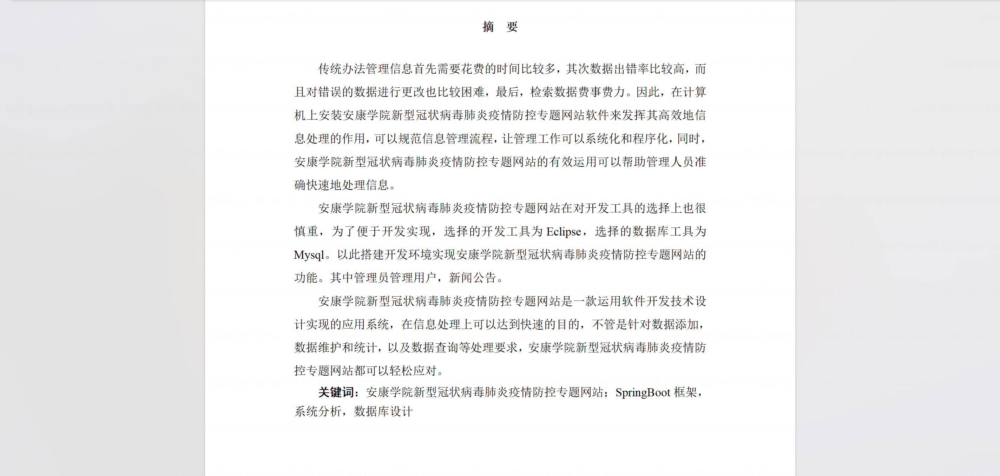
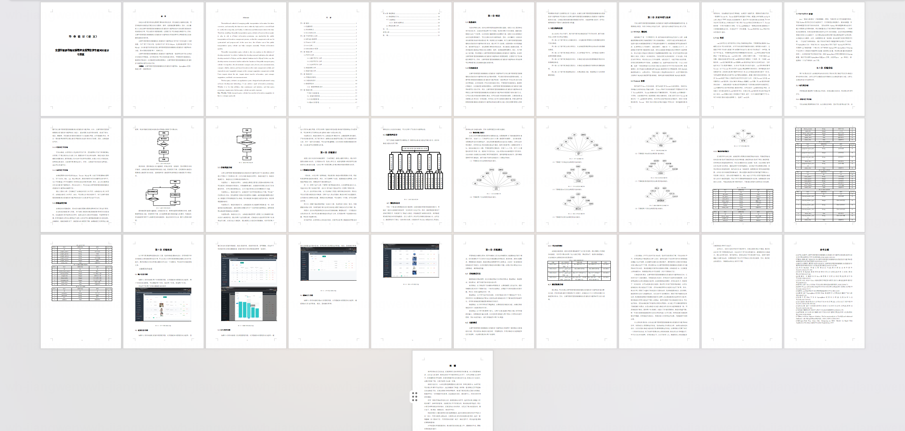
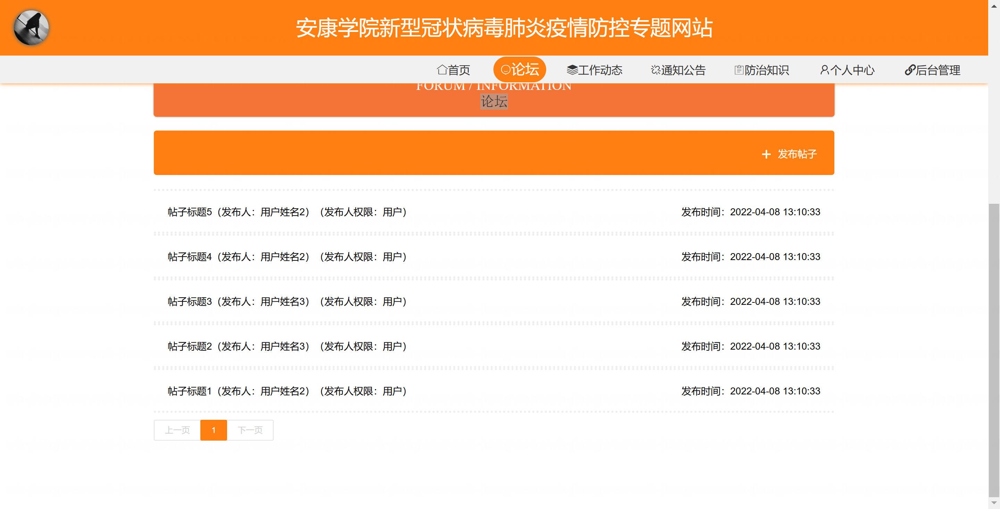
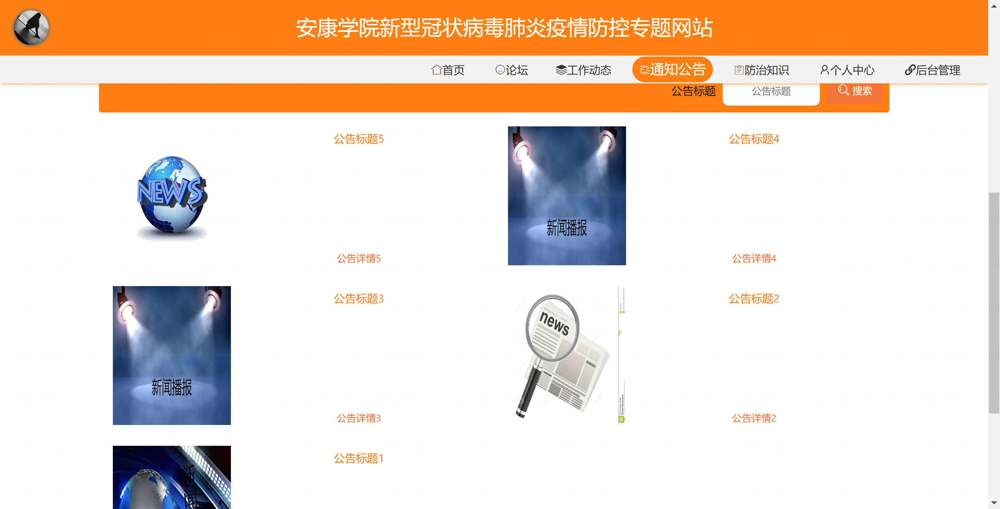
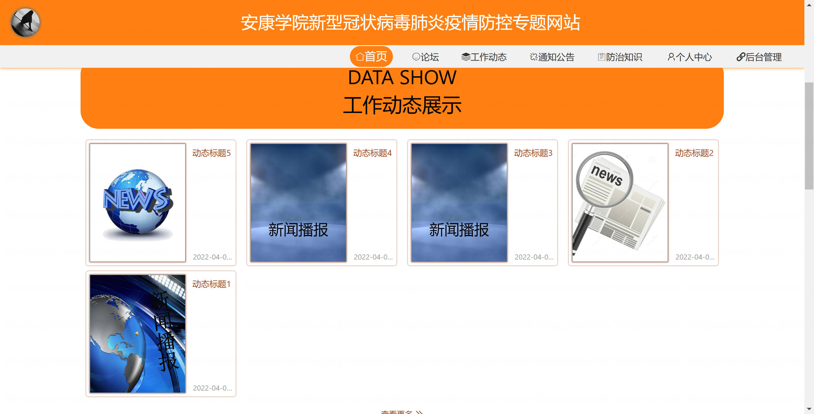
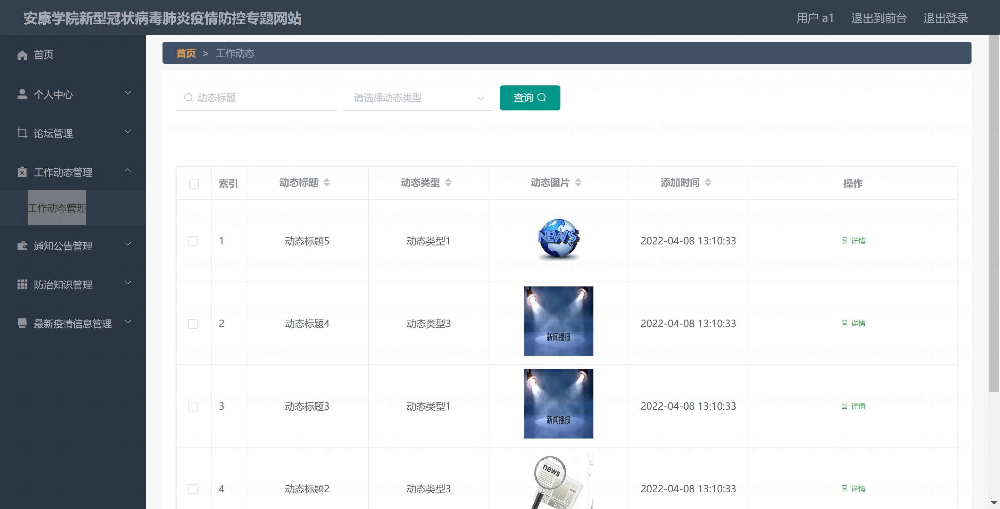
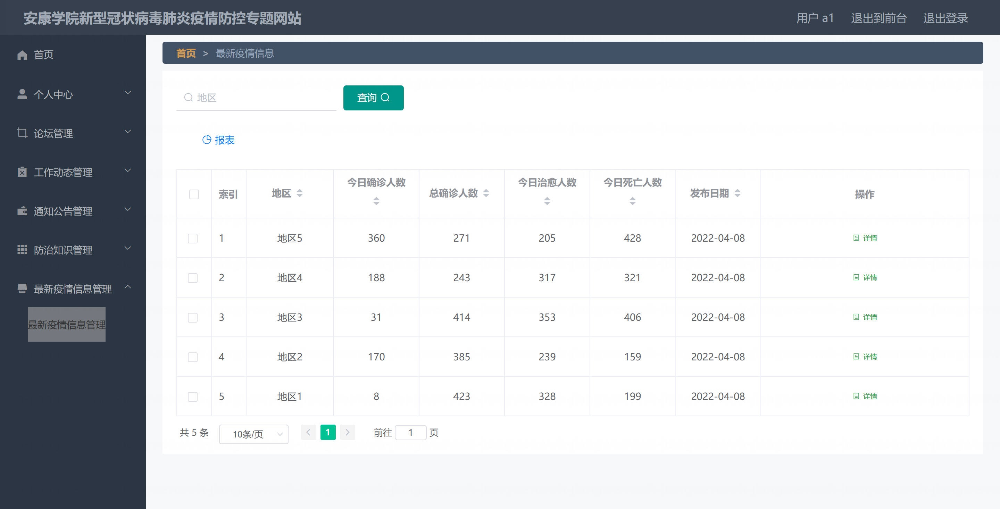
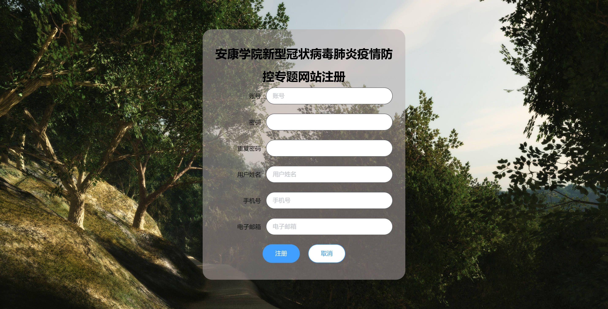
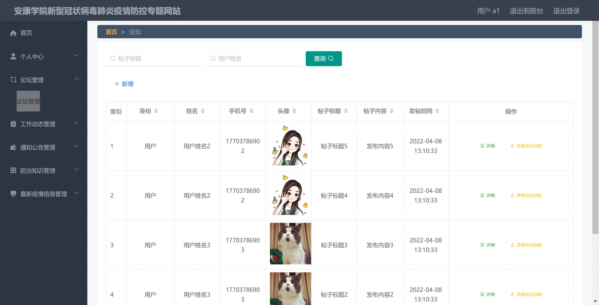

<h1 align="center">基于SpringBoot的疫情防控专题网站【带论文】</h1>

- <b>完整代码获取地址：从戎源码网 ([https://armycodes.com/](https://armycodes.com/))</b>
- <b>技术探讨、资料分享，请加QQ群：692619798</b>
- <b>作者微信：19941326836  QQ：3645296857</b>
- <b>承接计算机毕业设计、Java毕业设计、Python毕业设计、深度学习、机器学习</b>
- <b>选题+开题报告+任务书+程序定制+安装调试+论文+答辩ppt 一条龙服务</b>
- <b>所有选题地址 ([https://github.com/Descartes007/allProject](https://github.com/Descartes007/allProject)) </b>

## 一、项目介绍

基于SpringBoot的疫情防控专题网站，系统角色为后台管理员（管理端）与前台普通用户，主要功能如下：
### 管理员（后台）
- 基本操作：登录、退出、修改密码、获取/修改个人信息、会话管理
- 用户管理：用户列表/分页、查看/新增/修改/删除用户、重置密码、批量导入
- 内容管理：通知公告（news）、防治知识（xinwenguanzhu）、最新疫情（zuixinyiqing）、工作动态（gongzuodongtai）、新闻关注（xinwenguanzhu/）等的增删改查、分页列表、详情
- 论坛管理：帖子列表/发布/编辑/删除/详情、支持部分接口公开查看
### 普通用户（前台）
- 注册、登录、退出、修改密码、个人中心（查看/修改个人信息）
- 浏览内容：查看公告/新闻/防治知识/最新疫情/动态/论坛帖子、下载附件
- 参与互动：论坛发帖/查看详情、使用站内通用查询（如下拉联动）
- 前端存储 token/session，用于鉴权与会话保持

## 二、项目技术

- 编程语言：Java（后端）
- 项目架构：B/S 架构
- 前端技术：Vue.js（2.x），Vue Router，Element UI，Axios
- 后端技术：Spring Boot（Spring 全生态），MyBatis-Plus（简化 CRUD 与分页），自定义 TokenService 与 @IgnoreAuth 注解

## 三、运行环境

- JDK版本：1.8及以上都可以
- 操作系统：Windows7/10、MacOS
- 开发工具：IDEA、Ecplise、MyEclipse都可以

## 四、数据库配置文件

- npm版本：6.14.13及以上都可以
- Redis版本：3.2.100及以上都可以
- 文件名：application.yml
- 编码类型：utf8

## 论文截图

## 系统截图

